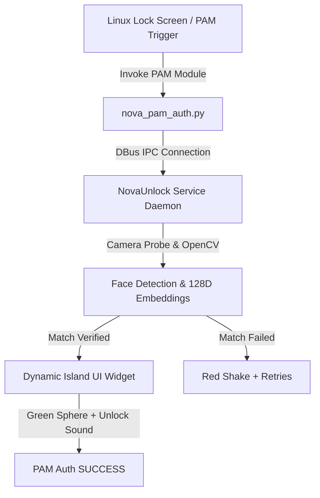

<div align="center">

# 🔒 Linux-FaceLock

### *Authentic Dynamic Island Face ID & PAM Face Authentication for Linux & Windows*

[](https://github.com/hananqaisar-commits/Linux-FaceLock/actions)
[](https://github.com/hananqaisar-commits/Linux-FaceLock/releases)
[](https://github.com/hananqaisar-commits/Linux-FaceLock/stargazers)
[](LICENSE)
[](https://python.org)
[](README.md)
[](CONTRIBUTING.md)

<br/>

**[Features](#-features)** • **[Installation](#-installation)** • **[Quick Demo](#-quick-demo)** • **[Architecture](#-architecture)** • **[Contributing](#-contributing)**

</div>


---

## ⚡ Overview

**Linux-FaceLock** is a next-generation, high-performance facial recognition lock screen integration for Linux desktop environments (GNOME, KDE Plasma, XFCE, LightDM, SDDM, GDM) and Windows.

Inspired by Apple's Dynamic Island aesthetics, it delivers **sub-second facial verification**, zero UI latency, smooth 60 FPS spring physics, interactive audio cues, and native Linux PAM stack security.

---

## ✨ Key Features

| Feature | Description |
| :--- | :--- |
| **🏝️ Dynamic Island UI** | Minimalist 280×38 pill widget floating seamlessly on your lock screen |
| **📷 Live Camera & Lock Morph** | Real-time camera icon `⚪` morphing dynamically into an animated unlocked `🔓` state |
| **🟢 3D Wireframe Mesh** | Futuristic green 3D sphere animation rendered on successful facial vector match |
| **🔊 Spatial Audio Feedback** | Interactive chime sound effects on popup, verification success, and invalid face shake |
| **🛡️ PAM Stack Security** | Native `pam_script` & PAM module integration (`gdm-password`, `lightdm`, `sudo`, `kscreenlocker`) |
| **📦 Multi-Distro Packages** | Pre-compiled packages for Ubuntu/Debian (`.deb`), Fedora/RPM (`.rpm`), and Arch (`.pkg.tar.zst`) |
| **🪟 Windows Bridge** | Windows Credential Provider unlock helper for dual-boot setups |

---

## 🚀 Installation

### Option 1: Native Package Manager (Recommended)

Download the latest binary release for your distribution from [GitHub Releases](https://github.com/hananqaisar-commits/Linux-FaceLock/releases):

#### 🌀 Debian / Ubuntu / Kali / Mint / Pop!_OS (`.deb`)
```bash
sudo dpkg -i NovaUnlock-v3.2-Debian.deb
sudo apt-get install -f
```

#### 🎩 Fedora / RHEL / openSUSE (`.rpm`)
```bash
sudo dnf install ./NovaUnlock-v3.2-Fedora.rpm
```

#### 🏹 Arch Linux / Manjaro (`.pkg.tar.zst`)
```bash
sudo pacman -U ./NovaUnlock-v3.2-Arch.pkg.tar.zst
```

---

### Option 2: Universal One-File Installer

Works on any Linux distribution without external package manager requirements:

```bash
chmod +x nova_unlock_installer_v3.2
sudo ./nova_unlock_installer_v3.2
```

---

### Option 3: Build & Run from Source

```bash
# Clone repository
git clone https://github.com/hananqaisar-commits/Linux-FaceLock.git
cd Linux-FaceLock

# Setup virtual environment
python3 -m venv .venv
source .venv/bin/activate
pip install -r requirements.txt

# Run interactive Dynamic Island demo
python3 -m nova_unlock.ui.face_unlock_widget --demo
```

---

## 🎬 Quick Demo & Enrollment

Try out the biometric lock screens and enrollment screens locally:

### 1. Face ID Animation & Scanner Demo
To launch the authentic iOS-style Dynamic Island scanner and cycle through scanning states (Success ➔ Fail ➔ Success) with audio effects:
```bash
python3 -m nova_unlock.ui.face_id_embed
```

### 2. Face Enrollment Wizard
To enroll your face biometric template and register it locally:
```bash
python3 -m nova_unlock.ui.enrollment_wizard
```
### 3. Welcome Screen Demo
To launch the interactive macOS-style hello welcome screen (with hello greeting, dynamic island animation, and chime sound):

```bash
python3 -m nova_unlock.ui.welcome_screen

```

### 4. Service enable on System boot

```bash

sudo systemctl enable nova-facelock.service

```

### 5. Service disable on System boot

```bash
sudo systemctl disable nova-facelock.service
```

---

## 🧠 Architecture Overview



---

## 🔒 Security & Privacy

- **Local Vector Storage**: Face embeddings are stored locally on your encrypted drive; no biometric data ever leaves your machine.
- **Liveness Detection**: Multi-frame blink & motion verification prevents static photo spoofs.
- **PAM Fallback**: Automatic seamless fallback to password prompt if face identification times out or is unrecognized.
- Please review our [SECURITY.md](SECURITY.md) for vulnerability disclosure guidelines.

---

## 🤝 Contributing

We welcome community contributions! Check out our [CONTRIBUTING.md](CONTRIBUTING.md) to get started with developer setup, testing, and PR guidelines.

---

## 🆚 How does it compare?

| | **Linux-FaceLock** | Howdy | fprintd |
|---|:---:|:---:|:---:|
| Dynamic Island UI | ✅ | ❌ | ❌ |
| PAM Integration | ✅ | ✅ | ✅ |
| Lock Screen Unlock | ✅ | ✅ | ❌ |
| Login Screen (LightDM/GDM) | ✅ | ❌ | ❌ |
| Suspend/Resume Auto-Relock | ✅ | ❌ | ❌ |
| Multi-distro Packages | ✅ `.deb` `.rpm` `.pkg` | `.deb` only | varies |
| Windows Support | ✅ | ❌ | ❌ |
| Audio Feedback | ✅ | ❌ | ❌ |
| Active Development (2026) | ✅ | ⚠️ | ⚠️ |

---

## 📄 License

This project is licensed under the **MIT License** — see the [LICENSE](LICENSE) file for details.

---

## ⭐ Star History

If Linux-FaceLock helped you, please consider giving it a ⭐ — it helps others discover the project!

<a href="https://star-history.com/#hananqaisar-commits/Linux-FaceLock&Date">
 <picture>
   <source media="(prefers-color-scheme: dark)" srcset="https://api.star-history.com/svg?repos=hananqaisar-commits/Linux-FaceLock&type=Date&theme=dark" />
   <source media="(prefers-color-scheme: light)" srcset="https://api.star-history.com/svg?repos=hananqaisar-commits/Linux-FaceLock&type=Date" />
   
 </picture>
</a>
