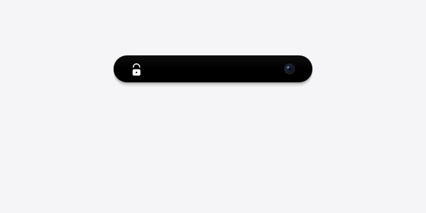

<div align="center">
# 🔐 NovaUnlock

### Open-Source Face Authentication and Face Unlock System for Linux

Linux Face Unlock • Face Recognition Login • PAM Authentication System • Privacy-First Biometric Security

---


</div>

---

## 📸 Interface Preview

<div align="center">
  
  &nbsp;&nbsp;&nbsp;
  
  <br/>
  <i>Dynamic iOS-inspired FaceLock UI with glowing ring effect and liveness detection.</i>
</div>

---

## 📌 Project Overview

**NovaUnlock** is an open-source Linux face authentication and face recognition login system designed to integrate biometric authentication into Linux desktop environments.

It enables users to authenticate system access using facial recognition through a webcam, integrated with Linux PAM (Pluggable Authentication Modules).

The system is designed for **local processing**, ensuring biometric data remains on the user’s device.

---

## 🔍 SEO Keywords (Important for Search Indexing)

This project targets the following search terms:

- Linux Face Unlock
- Linux Face Recognition Login
- Face Authentication for Linux
- Ubuntu Face Unlock System
- PAM Face Authentication Linux
- Biometric Login for Linux Desktop
- Open Source Face Recognition System
- Face Login Linux GitHub
- AI Face Unlock Linux (if ML module enabled)

---

## 🎯 Core Features

### 🔓 Face Authentication Login
Authenticate Linux users using real-time facial recognition via webcam.

### 🧩 PAM Integration
Seamless integration with Linux **PAM (Pluggable Authentication Modules)** for system-level login and authentication.

### 💾 Local Biometric Processing
All face detection and recognition runs locally:

- No cloud processing
- No external API calls
- No telemetry or tracking

### 👥 Multi-User Support
Supports multiple Linux user profiles with separate face data.

### 🔑 Secure Password Fallback
Automatically falls back to password authentication if face recognition fails.

### 📷 Webcam Support
Compatible with internal and external USB cameras.

### 🖥️ Desktop Environment Support
Tested on:

- Ubuntu (GNOME)
- Debian
- Kali Linux (XFCE / GNOME)
- Fedora
- KDE Plasma (experimental support)

---

# 🔓 NovaUnlock v5.3 — Face Lock System for Linux

> Facial recognition login & lock screen for Linux desktops
> Works on XFCE · GNOME · KDE · MATE · Cinnamon

---

## 🆕 Changelog — v5.3

| Feature | Description |
|---------|-------------|
| 🔴 **Anti-Spoof Blink Liveness** | Adaptive EAR detection — rejects photos/screens/masks |
| 🟠 **GTK Theme Auto-Switch** | Auto dark/light from gsettings · xfconf · gtk-3.0 |
| 🟢 **Auto-Lock on Face Leave** | Locks screen after 10s of face absence |

### 🔴 Liveness Detection
- **Adaptive EAR calibration** — learns YOUR eye ratio in 30 frames
- dlib 68-point landmarks (primary) + 5-strategy face detection
- MediaPipe Tasks / Legacy / OpenCV Haar fallback chain
- Rejects: printed photos, phone screens, static masks

### 🟠 GTK Theme
- Auto-detects dark/light at startup and every 6 seconds
- Sources: gsettings → gtk-3.0/settings.ini → xfconf → GTK_THEME
- Full Qt stylesheet for both modes

### 🟢 Auto-Lock Guard
- `FacePresenceGuard` — background thread monitors camera
- Triggers screen lock after `FACE_LEAVE_TIMEOUT=10s`
- Run: `python3 scripts/face_unlock_daemon.py --guard`

---


## 🆕 What's New in v5.3

### 🔴 Feature 1 — Anti-Spoof Blink Liveness Detection
- Eye Aspect Ratio (EAR) algorithm via MediaPipe FaceMesh
- Rejects: printed photos, phone/tablet screens, static masks
- Configurable blink count + timeout challenge
- Real-time EAR overlay on camera feed

### 🟠 Feature 2 — GTK Theme Auto-Switch
- Auto-detects system dark/light theme at startup
- Supports: gsettings, gtk-3.0/settings.ini, xfconf (XFCE), GTK_THEME env
- Polls for runtime theme changes every 6 seconds
- Full Qt stylesheet for dark + light palette
- Singleton `get_theme()` available project-wide

### 🟢 Feature 3 — Auto-Lock on Face Leave
- Continuous face presence monitoring via background thread
- Triggers screen lock when enrolled face absent for 10+ seconds
- Run daemon in guard mode: `python3 scripts/face_unlock_daemon.py --guard`
- Systemd service included for auto-start on login

---

## 🧠 System Architecture

NovaUnlock follows a modular authentication pipeline:

- Face Detection Module (OpenCV)
- Face Encoding Engine
- User Enrollment System
- Authentication Controller
- PAM Integration Layer
- Desktop Session Watcher

### Authentication Flow

1. User triggers login or screen lock
2. PAM requests authentication module
3. Webcam captures live input frame
4. Face detection extracts facial region
5. Feature encoding is generated
6. Encoded vector is matched with stored profile
7. Authentication result returned to PAM

---
## Installation

### Method 1: Git Clone (Recommended)

```bash
git clone https://github.com/hananqaisar-commits/NovaUnlock.git
cd NovaUnlock
sudo bash install.sh
```

### Method 2: Binary Release

```bash
wget -O nova_unlock_installer \
  https://github.com/hananqaisar-commits/NovaUnlock/releases/download/v4.6/nova_unlock_installer_v5.3
chmod +x nova_unlock_installer
sudo ./nova_unlock_installer
```

## Quick Start Guide

**1. Install Dependencies**
```bash
sudo bash install.sh
```

**2. Enroll Face Profile**
```bash
cd ~/NovaUnlock
source .venv/bin/activate
python3 scripts/enroll_gui.py
```
For better accuracy, capture multiple samples under different lighting conditions.

**3. Test Face Authentication UI**
```bash
python3 ~/NovaUnlock/nova_unlock/ui/face_id_screen.py
```

**4. Lock the System**

XFCE:
```bash
xflock4
```

GNOME:
```bash
dbus-send --type=method_call \
  --dest=org.gnome.ScreenSaver \
  /org/gnome/ScreenSaver \
  org.gnome.ScreenSaver.Lock
```

**5. Authenticate Using Face**

Look at the webcam. The system performs face matching, and login is granted automatically on a successful match.

## Security and Privacy Model

NovaUnlock follows a privacy-first design:

| Component | Behavior |
|---|---|
| Face Data Storage | Local filesystem only |
| Network Usage | Not required after installation |
| External APIs | Not used |
| Telemetry | None |
| Biometric Control | User-owned data |

## System Requirements

| Requirement | Minimum |
|---|---|
| Operating System | Linux (Ubuntu, Debian, Fedora, Kali) |
| Python Version | 3.11 or higher |
| Camera | USB or built-in webcam |
| RAM | 2 GB+ |
| Desktop Environment | GNOME, XFCE, KDE, Cinnamon |

## Project Status

NovaUnlock is under active development. Current focus areas include:

- Improving face recognition accuracy
- Expanding Linux distribution compatibility
- Strengthening PAM integration
- Enhancing system stability
- Improving authentication speed

## Known Limitations

- Performance depends on lighting conditions
- Webcam quality affects recognition accuracy
- Liveness detection is implementation-dependent
- Some desktop environments require manual configuration

## Contributing

Contributions are welcome. Ways to contribute include:

- Improving the face recognition pipeline
- Fixing Linux compatibility issues
- Enhancing PAM integration
- Improving documentation and examples
- Reporting bugs and issues

## License

This project is open-source. Refer to the LICENSE file for full terms.

## Author

**Hanan Qaisar**
GitHub: [https://github.com/hananqaisar-commits](https://github.com/hananqaisar-commits)