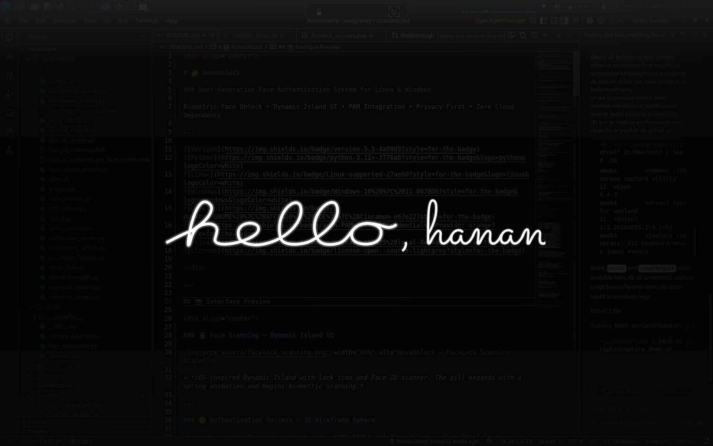

<div align="center">

# 🔐 NovaUnlock

### Next-Generation Face Authentication System for Linux & Windows

Biometric Face Unlock • Dynamic Island UI • PAM Integration • Privacy-First • Zero Cloud Dependency

---


</div>

---

## 📸 Interface Preview

<div align="center">

### 🔒 Face Scanning — Dynamic Island UI


> *iOS-inspired Dynamic Island with lock icon and Face ID scanner. The pill expands with a spring animation and begins biometric scanning.*

---

### 🟢 Authentication Success — 3D Wireframe Sphere


> *On successful face match: lock icon animates to unlocked (green glow), and an authentic iOS-style 3D wireframe sphere rotates with depth-sorted perspective rendering.*


### 👋 Welcome Greeting — Instant Hello Overlay



> *After successful unlock, an elegant full-screen greeting overlay appears instantly — "hello, {Username}" — with a subtle gradient accent line.*

</div>

---

## 📌 Project Overview

**NovaUnlock** is an open-source face authentication system that replaces traditional password login with real-time facial recognition. It integrates directly with **Linux PAM** and **Windows Credential Provider** for system-level biometric authentication.

Every aspect of the system is designed for **local processing** — no cloud APIs, no telemetry, no external dependencies. Your biometric data never leaves your device.

### Why NovaUnlock?

| Feature | NovaUnlock | Traditional Login |
|---|---|---|
| Authentication Speed | < 1 second | Manual typing |
| Security Layer | Biometric + Password fallback | Password only |
| Privacy | 100% local processing | Varies |
| User Experience | iOS-quality animations | Standard OS dialogs |
| Multi-Platform | Linux + Windows | OS-specific |

---

## 🎯 Core Features

### 🔓 Biometric Face Authentication
Real-time face recognition via webcam with configurable matching thresholds. Supports multiple face encodings per user for improved accuracy across lighting conditions.

### 🎨 Dynamic Island UI
An iOS-inspired animated interface built with PyQt5 featuring:
- **Spring-physics pill animation** with smooth expand/collapse
- **3D wireframe sphere** with perspective projection and depth-sorted rendering
- **Animated lock icon** that transitions from locked → unlocked with green glow
- **Face ID scanner icon** with natural eye-blink animation
- **Shake rejection effect** with spring-damped horizontal oscillation
- **Sound design** — procedurally generated pluck, bell, and whoosh audio cues

### 👋 Instant Welcome Overlay
After successful authentication, a full-screen greeting overlay displays instantly via Unix socket IPC — pre-warmed during the scan phase for zero-latency display.

### 🧩 PAM Integration (Linux)
Seamless integration with Linux **Pluggable Authentication Modules** for:
- Login screen authentication
- Lock screen unlock
- `sudo` elevation (optional)

### 🪟 Windows Credential Provider
Native Windows 10/11 support via a compiled C++ Credential Provider DLL that interfaces with LSA Secrets for secure password handling.

### 🔴 Anti-Spoof Liveness Detection
- **Adaptive EAR calibration** — learns your eye ratio in 30 frames
- dlib 68-point landmarks with 5-strategy face detection fallback
- MediaPipe Tasks / Legacy / OpenCV Haar cascade chain
- Rejects: printed photos, phone screens, static masks

### 💾 100% Local Processing
- No cloud APIs or external network calls
- No telemetry or tracking
- All face encoding data stored on local filesystem
- User-owned biometric data

### 👥 Multi-User Support
Separate face profiles per Linux/Windows user with independent encoding databases.

### 🔑 Secure Password Fallback
Automatic fallback to password authentication when:
- Face recognition fails after 3 attempts
- Camera is unavailable
- Liveness check fails

---

## 🖥️ Platform Support

### Linux
| Distribution | Desktop Environment | Status |
|---|---|---|
| Ubuntu 22.04+ | GNOME | ✅ Fully Tested |
| Debian 12+ | GNOME / XFCE | ✅ Fully Tested |
| Kali Linux | XFCE / GNOME | ✅ Fully Tested |
| Fedora 38+ | GNOME | ✅ Tested |
| KDE Plasma | KDE | ⚠️ Experimental |
| Cinnamon | Cinnamon | ✅ Tested |

### Windows
| Version | Status |
|---|---|
| Windows 10 (21H2+) | ✅ Supported |
| Windows 11 | ✅ Supported |

---

## 🚀 Installation

### Method 1: Linux — Quick Install

```bash
# Clone the repository
git clone https://github.com/hananqaisar-commits/NovaUnlock.git
cd NovaUnlock

# Run the installer (installs dependencies + PAM module)
sudo bash install.sh
```

### Method 2: Linux — Binary Release

```bash
wget https://github.com/hananqaisar-commits/NovaUnlock/releases/latest/download/nova_unlock_installer
chmod +x nova_unlock_installer
sudo ./nova_unlock_installer
```

### Method 3: Windows — Credential Provider

1. **Download** the Windows release ZIP from [GitHub Releases](https://github.com/hananqaisar-commits/NovaUnlock/releases)
2. **Extract** to `C:\NovaUnlock\`
3. **Enroll Face & Password**:
   ```powershell
   # Run as Administrator
   python scripts\windows_enroll_password.py
   ```
4. **Build Credential Provider** — Open `credential_provider\` in Visual Studio, build the C++ project
5. **Register** — Double-click `register.reg` to enable Face Unlock on the Windows Lock Screen

---

## ⚡ Quick Start (Linux)

```bash
# 1. Activate virtual environment
cd ~/NovaUnlock
source .venv/bin/activate

# 2. Enroll your face (GUI wizard with multi-angle capture)
python3 scripts/enroll_gui.py

# 3. Test the Face ID animation (demo mode)
python3 -m nova_unlock.ui.face_id_screen

# 4. Test live face authentication
python3 -m nova_unlock.ui.face_id_screen --test

# 5. Lock your screen and authenticate with your face!
xflock4                    # XFCE
loginctl lock-session      # GNOME / systemd
```

---

## 🧠 System Architecture

```
┌─────────────────────────────────────────────────────────────┐
│                    NovaUnlock Architecture                   │
├─────────────────────────────────────────────────────────────┤
│                                                             │
│  ┌──────────┐   ┌──────────────┐   ┌────────────────────┐  │
│  │  Camera   │──▶│ Face Detect  │──▶│ Face Recognition   │  │
│  │  Input    │   │  (OpenCV)    │   │  (face_recognition)│  │
│  └──────────┘   └──────────────┘   └────────┬───────────┘  │
│                                              │              │
│                                    ┌─────────▼──────────┐   │
│                                    │  Liveness Check    │   │
│                                    │  (EAR + Blink)     │   │
│                                    └─────────┬──────────┘   │
│                                              │              │
│  ┌──────────────────────────────────────────▼───────────┐  │
│  │              Authentication Controller               │  │
│  │   Match face encoding → Stored profiles → Decision   │  │
│  └───────────┬──────────────────────────┬───────────────┘  │
│              │                          │                   │
│  ┌───────────▼──────────┐  ┌───────────▼───────────────┐  │
│  │  Linux PAM Module    │  │ Windows Credential Provider│  │
│  │  (pam_nova_unlock)   │  │  (NovaUnlockProvider.dll) │  │
│  └──────────────────────┘  └───────────────────────────┘  │
│                                                             │
│  ┌──────────────────────────────────────────────────────┐  │
│  │              Dynamic Island UI (PyQt5)               │  │
│  │  Spring animations • 3D sphere • Sound design       │  │
│  └──────────────────────────────────────────────────────┘  │
│                                                             │
│  ┌──────────────────────────────────────────────────────┐  │
│  │           Hello Overlay (Unix Socket IPC)            │  │
│  │  Pre-warmed subprocess • Instant greeting display    │  │
│  └──────────────────────────────────────────────────────┘  │
└─────────────────────────────────────────────────────────────┘
```

### Authentication Flow

1. **Trigger** — User locks screen or initiates login
2. **PAM Request** — System calls NovaUnlock authentication module
3. **UI Launch** — Dynamic Island pill animates into view with spring physics
4. **Capture** — Webcam captures 4 frames with face detection (HOG model)
5. **Encode** — Face encodings extracted and averaged for noise reduction
6. **Match** — Encoded vector compared against stored user profiles
7. **Liveness** — EAR blink detection validates live presence
8. **Result** — Success: 3D sphere + unlock animation → screen unlocks
9. **Welcome** — Instant "hello, {user}" greeting overlay via pre-warmed socket

---

## 🔐 Security & Privacy

| Component | Implementation |
|---|---|
| **Face Data** | Stored as numpy arrays on local filesystem only |
| **Network** | Zero network calls — fully offline after install |
| **External APIs** | None used — all processing is local |
| **Telemetry** | None — no analytics, no tracking |
| **Biometric Control** | User-owned, user-deletable data |
| **Password Storage** | Linux: PAM / Windows: LSA Secrets (encrypted) |
| **Anti-Spoof** | EAR blink liveness + multi-frame validation |

---

## 📋 System Requirements

| Requirement | Minimum |
|---|---|
| **Operating System** | Linux (Ubuntu, Debian, Fedora, Kali) or Windows 10/11 |
| **Python** | 3.11 or higher |
| **Camera** | USB or built-in webcam |
| **RAM** | 2 GB+ |
| **Desktop (Linux)** | GNOME, XFCE, KDE, Cinnamon |

---

## 🆕 Changelog

### v5.5 — Current Release
- 🪟 Windows 10/11 Credential Provider support
- 🎨 Dynamic Island UI with 3D wireframe sphere
- 👋 Instant welcome overlay via Unix socket IPC
- 🔊 Procedural sound design (pluck, bell, whoosh)

### v1.32
- 🔴 Anti-spoof blink liveness detection (adaptive EAR)
- 🟠 GTK theme auto-switch (dark/light)
- 🟢 Auto-lock on face leave (10s timeout)

---

## 🤝 Contributing

Contributions are welcome! Areas of interest:

- **Face Recognition Pipeline** — Improving accuracy and speed
- **Linux Compatibility** — Testing on more distributions
- **Windows Integration** — Credential Provider improvements
- **UI/UX** — Animation refinements and accessibility
- **Documentation** — Tutorials, guides, and examples
- **Security** — Liveness detection hardening

---

## 📄 License

This project is open-source. See the [LICENSE](LICENSE) file for details.

---

<div align="center">

**Built by [Hanan Qaisar](https://github.com/hananqaisar-commits)**

*Secure your system with your face — not your password.*

</div>